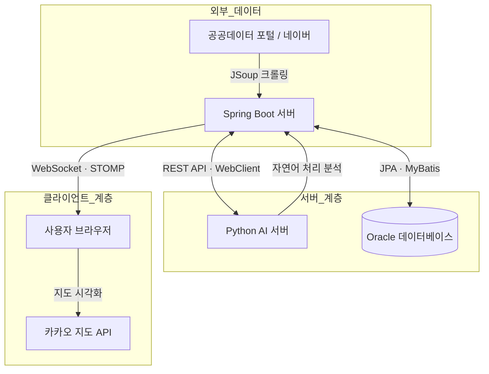

# 🛡️ SafetyNevi (안전네비)
### AI & GIS 기반 지능형 재난 안전 대피 플랫폼

> **"위기 상황에 빛이 되어줄 안전네비"**  
> 텍스트 중심의 재난 정보를 넘어, 가장 직관적이고 즉각적인 시각 정보를 제공합니다.

  
  
  
  
  
  
  

## 📑 목차 (Table of Contents)
1. [프로젝트 개요](#-프로젝트-개요-overview)
2. [시스템 아키텍처](#-시스템-아키텍처-system-architecture)
3. [파이프라인 상세](#-파이프라인-상세)
4. [주요 기능](#-주요-기능-key-features)
5. [팀원 및 역할 분담](#-팀원-및-역할-분담-roles--responsibilities)
6. [기술 스택](#기술-스택-technology)
7. [설치 및 실행](#-설치-및-실행-installation)
 

## 📖 프로젝트 개요 (Overview)

**SafetyNevi**는 기후 변화와 도시화로 인해 급증하는 재난 상황에서,  
기존 **텍스트 위주의 재난 문자 시스템**이 가진 한계(위치 파악의 어려움, 대피 경로 부재)를 극복하기 위해 개발된 **AI & 지도 기반 재난 대응 플랫폼**입니다.

자체 개발한 **AI 자연어 처리 모델**이 실시간 재난 문자를 분석하여  
**위험 지역을 지도상 Polygon(영역)으로 시각화**하고,  
사용자의 현재 위치를 기준으로 **‘운영 중’인 안전 대피소까지의 최적 경로**를 안내합니다.

### 💡 핵심 가치
1. **AI 자동 분석**  
   관리자 개입 없이 24시간 재난 위험도 자동 판별 (Accuracy ~92%, internal test set)

2. **직관적 시각화**  
   재난 텍스트 데이터를 GIS 데이터로 변환해 지도에 즉시 표출

3. **골든타임 확보**  
   실시간 위험 알림 + 최적 경로 안내로 신속한 대피 유도

---

## 🏗️ 시스템 아키텍처 (System Architecture)

본 프로젝트는 **Spring Boot 기반 메인 서버**와  
**Python FastAPI 기반 AI 서버**가 분리된 **MSA 지향 구조**로 설계되었습니다.

---

## 💻 파이프라인 상세

### 1. Data Ingestion (데이터 수집) 📥

* **주기:** 1분 간격
* **소스:** 공공기관의 재난 문자 크롤링 (Crawling)
* **데이터 형식:** 비정형 텍스트 데이터 수집

### 2. Preprocessing (데이터 전처리) 🛠️

* **목표:** AI 모델 학습 및 추론에 적합한 형태로 데이터 정제
* **주요 작업:**
    * Regex(정규 표현식) 기반 날짜 및 특수문자 제거
    * 행정구역 명칭 **정규화** (Normalization)

---

### 3. AI Inference (AI 추론) 🧠

| 항목 | 상세 내용 |
| :--- | :--- |
| **Model** | Scikit-learn **Multinomial Naive Bayes** |
| **Feature Extraction** | **TF-IDF Vectorizer** (Term Frequency-Inverse Document Frequency) |
| **Classification** | **재난 유형** (화재, 호우, 지진 등) 분류 및 **위험도** (DANGER/SAFE) 판별 |

### 4. Alerting & Scoring (경보 발령 및 확신도 계산) 🚨

* **Probability Scoring (확률 계산):** `predict_proba()` 함수를 사용하여 **확신도(Confidence Score)** 산출
* **Alert Threshold (경보 기준):** 계산된 확신도가 **90% 이상**일 경우에만 최종 사용자에게 경보를 발령
🛠️ 주요 기능 (Key Features)
1. 🚨 실시간 긴급 알림 & GIS 시각화
   AI가 위험을 감지하면 WebSocket을 통해 접속 중인 모든 사용자에게 긴급 모달 알림을 전송합니다.

행정구역 데이터(GeoJSON)와 매핑하여 지도상에 **붉은색 폴리곤(위험 구역)**을 렌더링합니다.

2. 🏃 사용자 맞춤형 안전 경로 안내
   단순 최단 거리가 아닌, **'현재 운영 중'**인 시설만 필터링합니다.

Kakao Mobility API를 연동하여 도보/차량 기준의 실제 이동 경로와 소요 시간을 계산합니다.

3. 🛡️ 시설물 정보 클러스터링
   전국 수천 개의 경찰서, 소방서, 병원, 대피소 데이터를 마커 클러스터링(Clusterer) 기법으로 지도에 깔끔하게 표출합니다.

줌 레벨에 따라 시/구/동 단위로 정보를 집약하여 보여줍니다.

4. 📢 위치 기반 안전 커뮤니티
   지도 위에서 직접 위치를 지정하여 제보 게시글을 작성할 수 있습니다.

실시간 댓글 및 좋아요 기능을 통해 시민들 간의 상황 공유가 가능합니다.

👨‍💻 팀원 및 역할 분담 (Roles & Responsibilities)

| 이름 | 포지션 | 상세 역할 (R&R)                                                                                                                                                                                                                                                 |
| :--- | :--- |:------------------------------------------------------------------------------------------------------------------------------------------------------------------------------------------------------------------------------------------------------------|
| **이상혁** | **Tech Lead & PM** | • **AI/System Architecture:** Python AI 서버 구축, 모델 학습, 시스템 통합 설계 • **Core Logic:** 지도 서비스 핵심(폴리곤 시각화, 경로 탐색), WebSocket 구현  • **Database & Report:** Oracle DB 스키마 설계 및 관리자 기능 구현, 최종 보고서 작성  • **Deployment:** DigitalOcean 서버 배포, Docker DB 구성, Ngrok 터널링 |
| **유기민** | **Backend Core** | • **Data Pipeline:** 재난 문자 크롤링 로직 및 스케줄러 구현 • **API Dev:** 게시판/공지/문의 REST API 설계 및 개발 • **Database:** Oracle DB 스키마 설계 및 관리자 기능 구현                                                                                                                    |
| **김보겸** | **Frontend Lead** | • **UI/UX:** 전체 웹 페이지 퍼블리싱 및 반응형 디자인 적용 • **Design:** 로고, 아이콘, 핀포인트 등 그래픽 리소스 제작, 발표용 PPTX 제작 • **User Flow:** 회원가입, 로그인, 마이페이지 UX 설계                                                                                                                              |
| **이진혁** | **Frontend Support** | • **Content:** 재난 행동요령 페이지 콘텐츠 구성 및 스타일링 • **Data:** 테스트 데이터셋 조사 및 시각화 보조                                                                                                                                                                                |

| 분류 (Category) | 기술 스택 (Technology) |
| :--- | :--- |
| **Backend** | Java 21, Spring Boot 3.5.6, Spring Security, JPA |
| **AI Server** | Python 3.10, FastAPI, Scikit-learn, Pandas, Joblib |
| **Frontend** | JavaScript (ES6+), Thymeleaf, HTML5, CSS3 |
| **Database** | Oracle Database 21c XE (via Docker) |
| **External API** | Kakao Map/Mobility API, Public Data Portal, Naver Search |
| **Infrastructure** | DigitalOcean Droplet (Ubuntu), Docker, Ngrok |

# 🚀 설치 및 실행 (Installation)
1. Python AI Server

# 필수 라이브러리 설치
pip install fastapi uvicorn scikit-learn pandas oracledb joblib

# AI 서버 실행 (Port: 8000)
uvicorn main:app --host 0.0.0.0 --port 8000

2. Spring Boot Server

# 프로젝트 빌드
./gradlew build -x test

# 서버 실행 (Port: 9090) - 환경 변수 주입 필요
./start.sh

©️ License
This project is developed for academic purposes by the SafetyNevi Team.